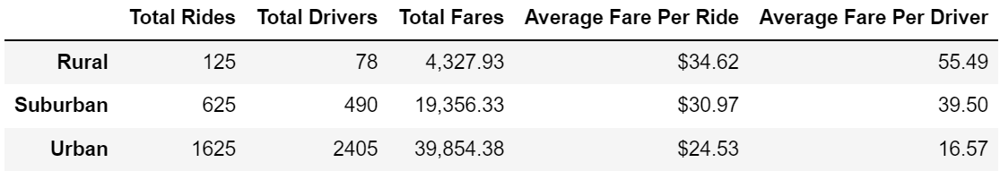
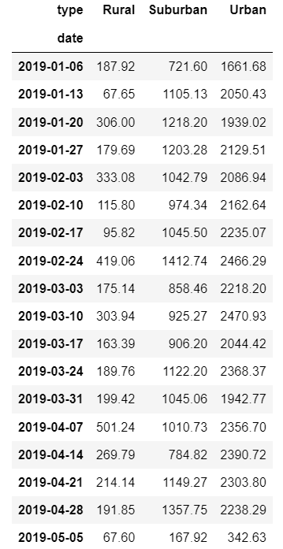
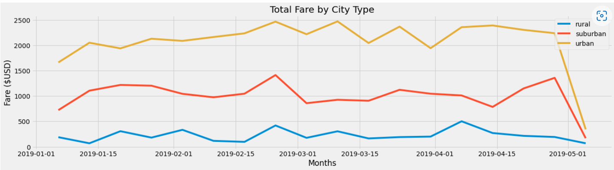

# PyBer_Analysis
## Overview
The goal of this analysis was to analyse and visualize ride-sharing data between cities and sity types. Matplotlib and object oriented functions were used to produce dataframes and a line graph to determine the results of the research.

## Results

### Totals Summary

Based to the totals summary given above, urban areas see the most activits and produce the most revenue. This is expected since densely populated areas with large amounts of economic require the most transportation. Many people opt to avoid doing their own driving to avoid the frustrations of traffic and possible damage to their vehicles. However, the total fares per city type seem to have an inverse relationship with the average fares per ride and per driver. Average fares are higher in rural areas. Possibly because of the limited amount of drivers and passengers needing rides.

### Weekly Summary

### Total Fare by City Weekly

The weekly summary dataframe and Total fare graph back up the findings shown in the totals summary. 

## Summary
To gain more riders and revenue in the rural areas, ride sharing must become more attractive to potential customers. This may be done by reducing fares in rural areas
